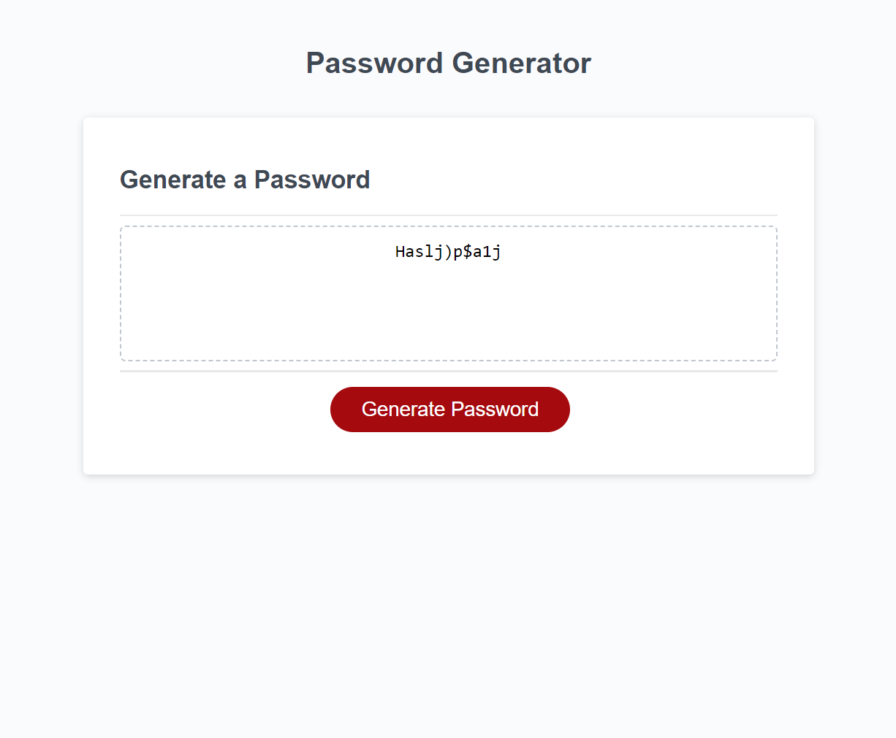

# Password Generator Starter Code

## Description

Having taken JavaScript as a High School student, I have long been anticipating the part of the course where we get to write code using JS.  It is my personal favorite language, due to the sheer versatility it has to offer.  I have used multiple parts of this project's code in the past.  I have used Math.floor and Math.random, for instance, in the creation of past projects (personal and professional).

Passwords have become an integral part of our daily life in the virtual world.  Gone are the days of the internet being open-access.  Due to the prevalence of identity theft, illegal data mining, and other such virtual skulduggery the username and password system has become standard.  These days even that has become insecure, with two-factor verification being the optimal route.  Learning how our passwords are randomly generated has provided me with a glimpse behind the curtain - and the code is surprisingly simple and accessible.

With some slight alterations, this code could be further optimized to prevent repetition and force further diversification of passwords.  Perhaps put into a simple app so passwords could be generated as needed on the go.

## Usage

The code can be found live online at https://golemancer-ctrl.github.io/wc-password-03/.

## Credits

 - https://dev.to/code_mystery/random-password-generator-using-javascript-6a

 - https://www.w3schools.com/js/js_random.asp

 - https://zetcode.com/javascript/add-string/

 - https://www.w3schools.com/jsref/jsref_substring.asp

 - https://developer.mozilla.org/en-US/docs/Web/JavaScript/Reference/Global_Objects/Math/random
 
 - https://developer.mozilla.org/en-US/docs/Web/JavaScript/Reference/Global_Objects/parseInt

